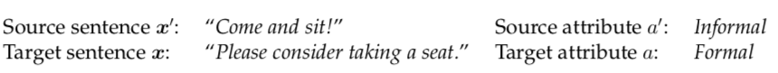

**Style-conditioned LM**: Predict **p(x \| a)**

**Text-style Transfer**: Predict **p(x \| a, x')**

## Papers

- [A computational approach to politeness with application to social factors](https://www.aclweb.org/anthology/P13-1025.pdf)
- [Delete, Retrieve, Generate: a Simple Approach to Sentiment and Style Transfer](https://www.aclweb.org/anthology/N18-1169.pdf)
- [Politeness Transfer: A Tag and Generate Approach](https://arxiv.org/pdf/2004.14257.pdf)
- [Style Transfer Through Back-Translation](https://www.aclweb.org/anthology/P18-1080.pdf)
- [Facilitating the Communication of Politeness through Fine-Grained Paraphrasing](https://www.aclweb.org/anthology/2020.emnlp-main.416.pdf)
- [Polite Dialogue Generation Without Parallel Data](https://arxiv.org/pdf/1805.03162.pdf)
- [Controlling Politeness in Neural Machine Translation via Side Constraints](https://www.aclweb.org/anthology/N16-1005.pdf)
- [Style Transfer in Text: Exploration and Evaluation](https://arxiv.org/pdf/1711.06861.pdf)
- [Style Transfer from Non-Parallel Text by Cross-Alignment](https://papers.nips.cc/paper/2017/file/2d2c8394e31101a261abf1784302bf75-Paper.pdf)
- [Interpreting Neural Networks to Improve Politeness Comprehension](https://www.aclweb.org/anthology/D16-1216.pdf)
- [Deep Learning for Text Style Transfer: A Survey](https://arxiv.org/pdf/2011.00416.pdf)

<!--  -->
<!-- <a href="https://www.w3schools.com">
[PDF]
</a> -->

### Delete, Retrieve, Generate: a Simple Approach to Sentiment and Style Transfer

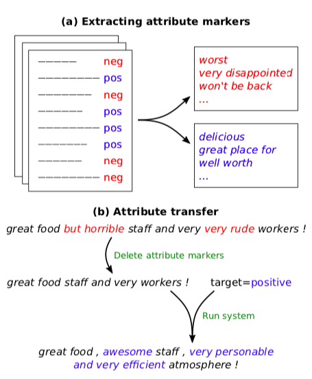
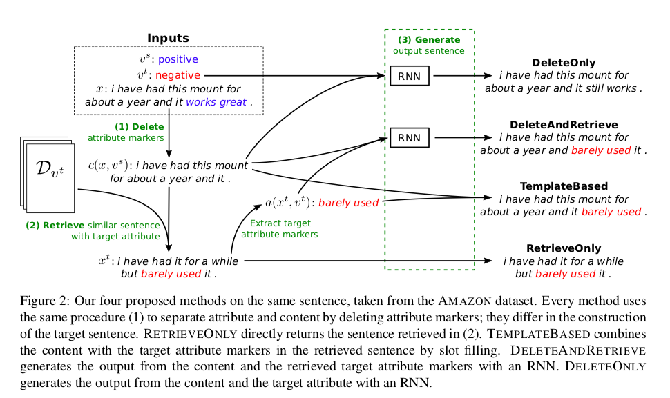

- Non-parallel corpus
- Prototype-Editing method (Std steps)
    1. Detect attribute markers of a in the input sentence x, and delete them, resulting in a content-only sentence (n-gram based heuristic)
    2. Retrieve candidate attribute markers with similar content and carrying the desired attribute a′
    3. (Generate) Infill the sentence by adding new attribute markers and make sure the generated sentence is fluent

** Note that: DeleteOnly and DeleteAndRetrieve need ML training and during training, target attributes are not available

DeleteOnly Training:\
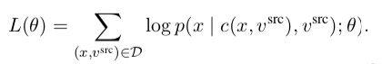

DeleteAndRetrieve Training:\
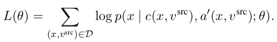

It uses denoising auto-encoder to prevent trivial solutions.

- YELP, Amazon Reviews (Sentiment Transfer), Captions (Factual to Humor/ Romance)

### Politeness Transfer: A Tag and Generate Approach {#politeness-transfer}

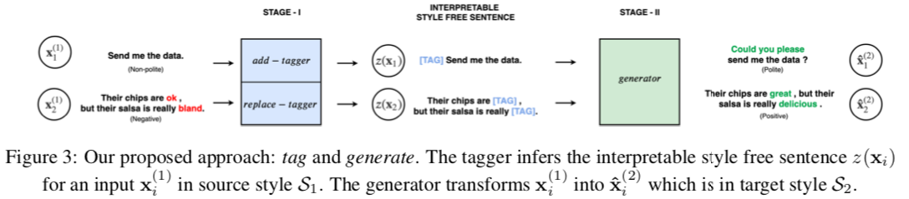

- Task: either generate samples of X1 in S2 given X1 OR X2 in S1 given X2
- Non-Parallel Corpora (not corupus) - for 2 styles
- Prototype-Editing method
- Key differences:
    - No DELETE
    - More interpretable intermediate representation
    - "Neutral" to Specific-Style Transfer
- Method
    - Add-tagger for Neutral -> Style (Politeness/ Caption-Style transfer)
    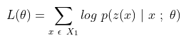
    - Replace-tagger for Style1 -> Style2 (Sentiment-transfer)
    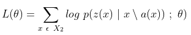
    - Generation\
    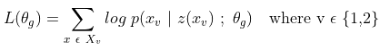
- Datasets: Enron (Politeness), Gender, Political datasets
- Used Transformers

### A computational approach to politeness with application to social factors

- Introduced politeness strategies using computational framework
- SVM-based classifiers: BOW (only unigrams), Linguistically informed (LING)
- Introduced Stanford Politeness Corpus (Annotated Wiki, Stack Exchange datasets)
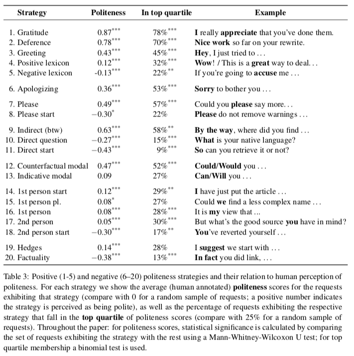

### Interpreting Neural Networks to Improve Politeness Comprehension

- CNN-based classifier

### Polite Dialogue Generation Without Parallel Data

- Politeness Classifier: Bi-LSTM + CNN classifier\
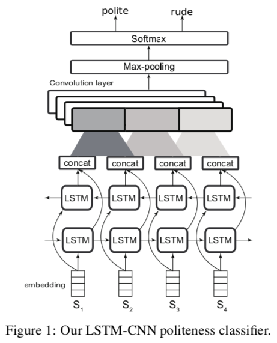

- Baseline(Seq2Seq): 2-layer LSTM-RNN encoder + 4-layer LSTM-RNN decoder
- Fusion model: final output as linear combination of Seq2Seq & Polite-LM
    - Polite-LM: 2-layer LSTM-RNN
    - Drawbacks: conversation not attended; politeness not used during training\
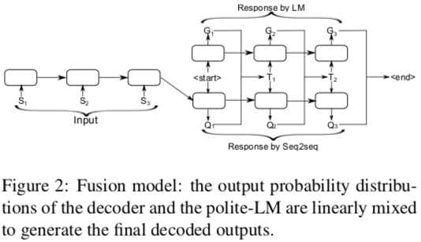
- Label-Fine-Tuning model
    - Borrowed from Spithourakis et al. (2016)
    - Politeness label prepended to trainable word embedding; embedding scaled acc to politeness score
    - During training, politeness score received from Politeness Classifier
    - During inference, we choose politeness score as per application
    - Label serves as prior for style, source utterance for content\
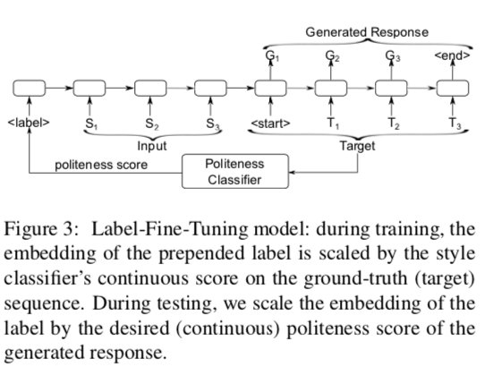
- Polite RL model
    - Borrowed from Paulus et al. (2018)
    - Loss is combination of MLE-based (teacher-forcing) and RL-based (politeness score of classifier)\
    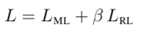

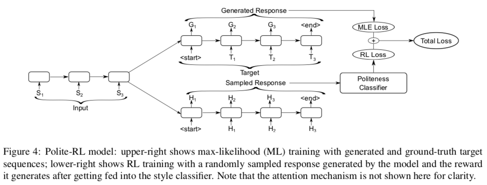

- Stanford Politeness Corpus

### Style Transfer Through Back-Translation

- Non-Parallel Corpora
- Based on hypothesis by Rabinovich et al. (2016) that latent code z obtained through back-translation will generate a sentence devoid of style attributes (like author's traits)
- z(French) is used to generate English sentence in different styles (e.g. Republican/ Democrat)
- Decoders: Bi-LSTM, Classifier: CNN-based
- Yelp (Gender), Yelp Reviews, Facebook-comments of US Senate & House (Political slant)
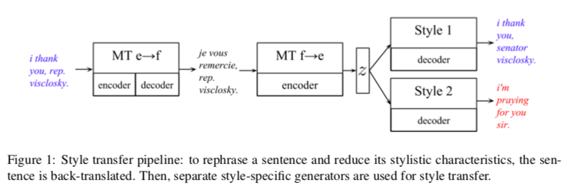
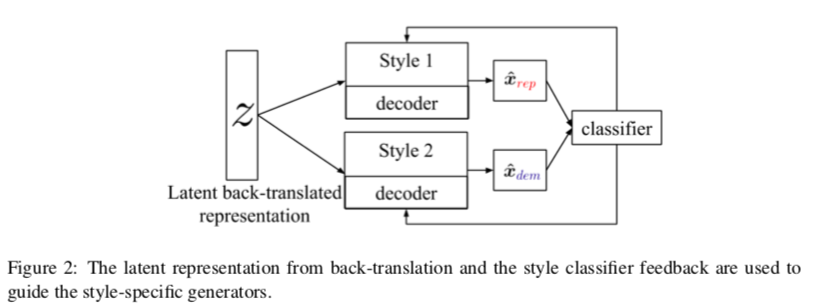

### Controlling Politeness in Neural Machine Translation via Side Constraints

- Politeness understood as T-V distinction (i.e. to address second person informally/ formally)
    - English - no distinction (you)
    - Hindi (tu-aap), Romanian (tu-dumneavoastră), German (tu-vos)
- \<T\> or \<V\> added as extra source token to impose side-constraint
- Parallel Corpus: OpenSubtitles2013

### Facilitating the Communication of Politeness through Fine-Grained Paraphrasing

### Style Transfer in Text: Exploration and Evaluation

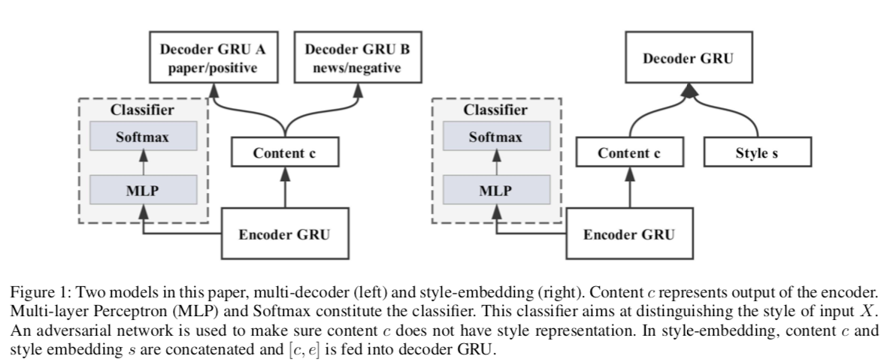
- Encoder: GRU
- Multi-Decoder Model
    - ~ Autoencoders with multiple decoders (for different styles)
    - Disentangle Style from Content
        - First eqn minimizes NLL of classifying style label of x given the representation by the encoder (M-samples, N-styles)
        - Second eqn makes the classifier unable to identify style of x by minimizing the negative entropy of the predicted style labels. Together they disentangle style from content in adversarial way
        - Third eqn gives the decoding loss function for generating outputs in each style (Seq2Seq loss)
        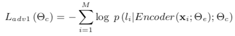
        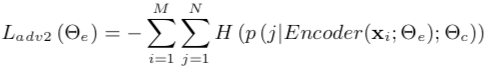
        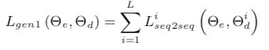
        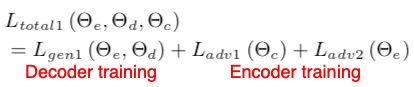
    - Style-Embedding Model
        - E: (N X ds) where N = #styles, ds = dim(style)
        - Style embeddings (E) now additionally fed
        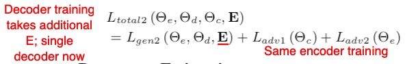

### Parallel Data Augmentation for Formality Style Transfer

- Back-Translation
- Formality discrimination
    - Use Google translate for informal -> formal and then pass it through a CNN
    - Keep only the pairs which largely improve the formality:
    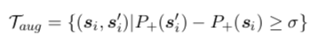
- Multi-task transfer
    - Pass through Grammatical Error Correction (Ge et al. 2019)
    - Claim/ observation: Informal=ungrammatical, formal=grammatical

### Discussion on Interesting Ideas:

- Neural Editor for Prototype Editing (Generating Sentences by Editing Prototypes)\
The motivation is that sentences from the corpus provide a high quality starting point: they are grammatical, naturally diverse, and exhibit no bias to- wards shortness or vagueness. The attention mechanism (Bahdanau et al., 2015) of the neural editor strongly biases the generation towards the prototype, and therefore it needs to solve a much easier problem than generating from scratch.

- Better evaluation metrics
    - Survey done by Reformulating Unsupervised Style Transfer as Paraphrase Generation
    - Transfer Accuracy: used RoBERTa-large fine-tuning instead of 1-layer CNN
    - Semantic Similarity: replaced n-gram metrics like BLEU with subword embedding-based SIM model of Weiting et al. (2019)
    - Fluency: replaced perplexity with accuracy of RoBERTa-large classifier trained on CoLA corpus

- No need of separating style and content
    - Style Transformer: Unpaired Text Style Transfer without Disentangled Latent Representation
        - Another motivation: The recurrent neural network (RNN) based encoder and decoder, mediated by the latent representation, cannot well deal with the issue of the long-term dependency, resulting in poor preservation of non-stylistic semantic content.\
        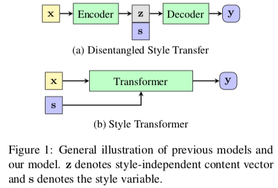

    - Multiple-attribute text rewriting

### References
- Ge et al. (2019) Automatic grammatical error correction for sequence-to-sequence text generation
- Weiting et al. (2019) Beyond BLEU: Training Neural Machine Translation with Semantic Similarity